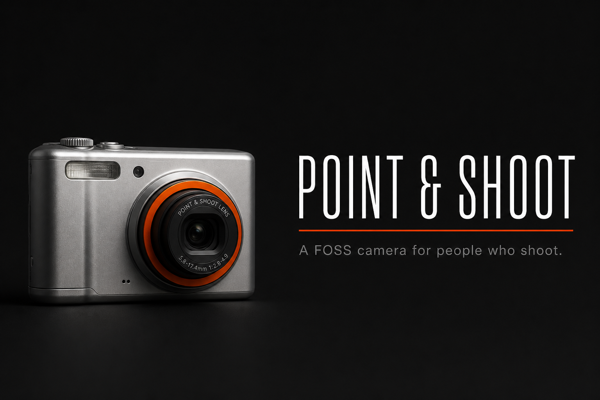
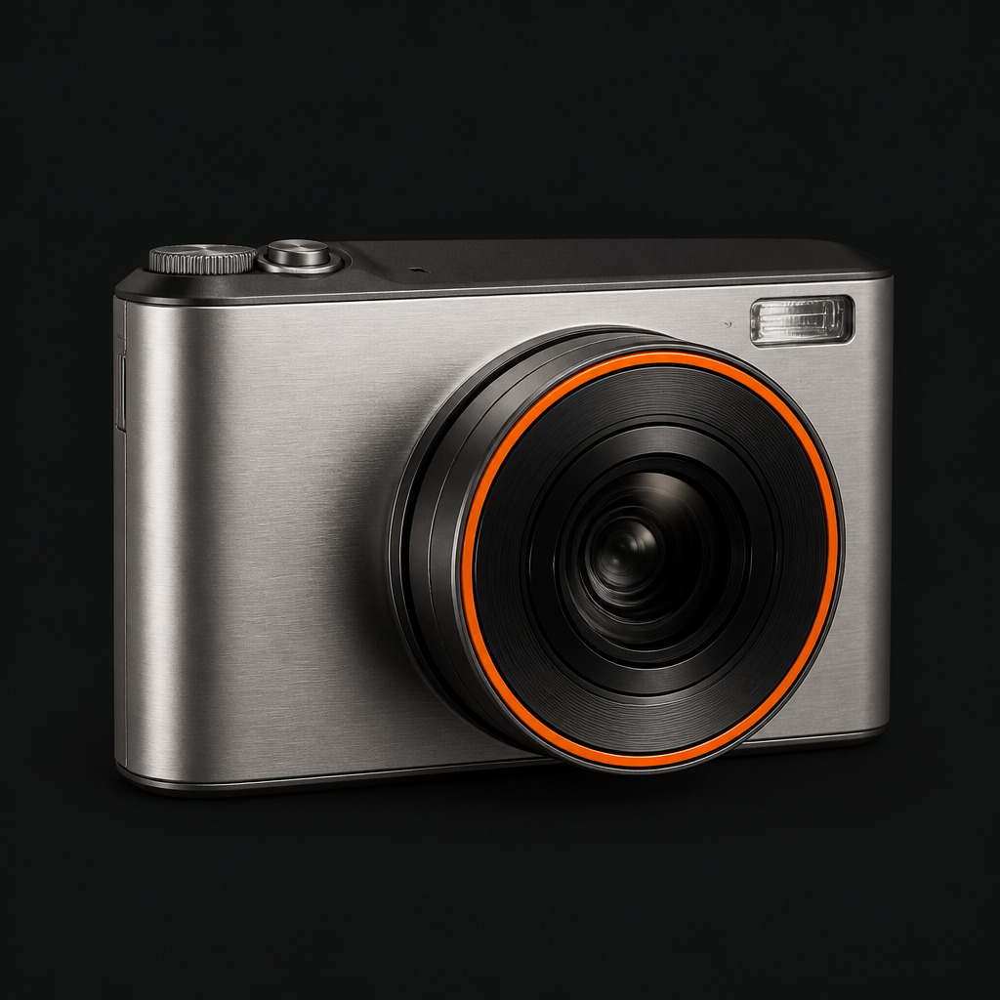

<p align="center">
  
</p>

<p align="center">
  
</p>

<h1 align="center">Point &amp; Shoot</h1>

<p align="center"><strong>A FOSS camera for people who shoot.</strong></p>

<p align="center">
  Predictable controls. Honest hardware. Files that open where you edit.<br />
  No Play Services. No proprietary blobs. Apache-2.0.
</p>

<p align="center">
  <a href="https://github.com/edwardlthompson/point-and-shoot/releases/latest"></a>
  <a href="LICENSE"></a>
  <a href="https://github.com/edwardlthompson/point-and-shoot/actions/workflows/toolchain-verify.yml"></a>
</p>

---

Most phone cameras try to be clever. Point & Shoot tries to be **a camera**.

You get a finder you can trust, a readout you can read in sunlight, and files you can take into Lightroom. What the hardware cannot do stays hidden — no greyed-out theater. What it can do, you drive: aperture, shutter, ISO, LUT, focal length, Photo / Video / Webcam.

**Get it:** [GitHub Releases](https://github.com/edwardlthompson/point-and-shoot/releases/latest) · [Obtainium](https://github.com/ImranR98/Obtainium) (`https://github.com/edwardlthompson/point-and-shoot`) · F-Droid listing in progress

---

## The finder

A locked portrait chrome built for shooting, not browsing settings.

- **3:4 live finder** with a professional readout: ISO, shutter, white balance, aperture when the lens has it, AF, LUT
- **7×3 quick grid** — focal lengths and the tools you actually tap, including Settings on the rail
- **Command dial** — A / M / H / S / BKT / Macro, plus Photo, Video, and Webcam on the tray
- **Dodge tele row** — 73 / 85 / 150 mm on the mid-tele when the phone has it
- **Looks on the glass** — built-in and imported `.cube` LUTs, focus peaking, RGB histogram, zebras, horizon, eye-AF overlay
- **Landscape** uses finder beside the rail; portrait chrome stays put
- **Selfie ring**, smile still, QR scan, and a status bar that shows timecode and meters while you record

## Stills that survive the desktop

- **DNG first** — loadable files, not “phone RAW” that Adobe refuses
- Hardware **JPEG** when you want a companion, optional artist/copyright on JPEG only (never rewritten onto DNG)
- **ZSL, HDR, brackets, burst** — including long-press JPEG burst with a real cadence
- **Recipes** — concert/museum silent, airplane-safe, intervalometer with ISO ramp, motion trip
- **Geotag** Off / Coarse / Precise (coarse ~1 km; DNG is never EXIF-rewritten)
- **Home widget** that fires a still
- Power profile: Performance / Balanced / Endurance

## Video you can finish

- In-app **H.264 / HEVC** MP4, high frame rates when the encoder allows, 10-bit and **HDR10** on Dual Conversion Gain stacks
- **RAW video** (`.mcraw`) when you want the sensor, not a baked clip
- Format picker, video LUT on the finder, stabilization when the HAL has it
- Timecode, audio meters, hi-fi extras, wind filter, chapter marks on volume-up
- **Stacked dual video** into one MP4
- Honest remaining-minutes and thermal/battery FPS — a toast when the finder is capped, not a silent lie

## Out of the pocket

- **USB webcam** — on Lineage, USB → Webcam so Windows Camera, Zoom, and Teams see **Android Webcam** (inbox UVC)
- **HDMI / MJPEG** — clean feed over a cable, or `mjpeg` / snapshot for OBS and VLC
- **Wear OS** remote or timer — countdown, cancel, vibrate, BLE or LAN, no Play Services
- **LAN roll** — list and proof files on the network

## A gallery that is a desk

Not a film-roll graveyard.

- Compare side by side, cull stacks, day contact sheets, keywords and collections, travel days
- DNG + JPEG (and night / bracket stacks) share and delete as **one shot**
- Trim, pull a frame, bake a LUT, vault copy, Immich / WebDAV, redact-before-share
- SHA-256 evidence and a redacted bug pack when something breaks
- Capture journal of last saved and failed stills — no logcat required

## Honest on every phone

Point & Shoot learns the device. Unavailable features **disappear**. Root-only tools stay visible and say so.

Primary development is on a **OnePlus 12**. The same app is meant to travel — capability catalog and parity, not a pile of one-off OEM flags.

**Privacy is default.** No analytics. On-device face work. Network features are opt-in. See [PRIVACY.md](PRIVACY.md).

## Install & updates

| | |
|---|---|
| **Package** | `dev.pointandshoot` |
| **GitHub** | [Releases](https://github.com/edwardlthompson/point-and-shoot/releases) — signed APK on each ship |
| **Obtainium** | Add `https://github.com/edwardlthompson/point-and-shoot` · on-device: `obtainium://add/github.com/edwardlthompson/point-and-shoot` |
| **In-app** | About → Check for updates, Wi-Fi-only option, SHA-256 on the install dialog |
| **F-Droid** | Metadata is in-repo; listing is next |

A production-signed build will not replace a debug-signed sideload. Uninstall the old one first.

Support the work: Venmo from **About & heritage**.

---

## For people who build it

This repo is a product, then a workshop. Start at [docs/START_HERE.md](docs/START_HERE.md), then [AGENTS.md](AGENTS.md) for capture locks and scripts. [CONTRIBUTING.md](CONTRIBUTING.md) is the human path.

```powershell
.\scripts\pns_sideload_and_launch.ps1
```

License: [Apache-2.0](LICENSE) · Notices: [NOTICE](NOTICE) · [LICENSES.md](LICENSES.md) · [CHANGELOG.md](CHANGELOG.md) · [SECURITY.md](SECURITY.md)
