<p align="center">
  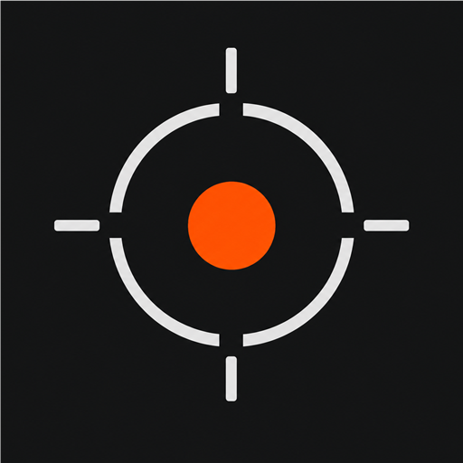
</p>

# Point & Shoot

[](https://github.com/edwardlthompson/point-and-shoot/actions/workflows/toolchain-verify.yml)
[](https://github.com/edwardlthompson/point-and-shoot/actions/workflows/plan-doc-verify.yml)
[](LICENSE)

A FOSS pro camera app for the **OnePlus 13 (`dodge`)** running **LineageOS 23 (Android 16 / API 36)**.

> Predictable controls. RAW-first workflows. A HUD designed for shooting. **No proprietary blobs. No Google Play Services.**

- **Stack**: Kotlin 2.1+, Jetpack Compose, Camera2, NDK (C++23), CMake
- **Output formats** (planned): DNG (RAW12), AVIF (10-bit HDR), JPEG XL (12-bit)
- **Min / target / compile SDK**: 28 / 36 / 36
- **License**: Apache-2.0
- **Constraint**: zero proprietary binaries, no Google Play Services dependencies

## Why this exists

- **Speed and determinism** — camera behavior you can learn and trust.
- **Modern formats** — RAW (DNG) plus AVIF/JXL targets for high-quality stills.
- **Device-specific excellence** — a "dodge" profile tuned to the OnePlus 13 camera stack instead of trying to be everything for everyone.

## Highlights

- **Comprehensive Camera2 capability probe**
  - Deep characteristics, session-configuration matrix, HDR/DCG runtime, capture latency, RAW + dynamic-range exclusivity, burst / AE bracket, logical-vs-physical, exhaustive HFR + encoder matrix, legacy Camera1 sanity.
  - JSON artifacts that survive on-device runs and a Markdown export for review.
- **Host orchestration** (`scripts/pns_hfr_autorun.ps1`)
  - Build → install → grant camera → run any subset of probes → pull JSON → write a suite-summary file → optional Phase 9 thermal snapshot.
- **Toolchain gate** (`scripts/pns_verify_toolchain.ps1`)
  - Gradle `assembleDebug`, UTF-8 enforcement on Kotlin and PowerShell, PowerShell parser sanity. Mirrored in CI on Ubuntu (`.github/workflows/toolchain-verify.yml`).
- **CLI-only workflow** — every step runs from PowerShell + ADB; Android Studio is optional.

## Imaging-engine targets (roadmap)

These are **not implemented yet** — they are the targets the probe is gating decisions for:

- **Standard Pro** profile: lossless-compressed DNG + 10-bit AVIF (HDR) + Display P3
- **Ultra-Max** profile: uncompressed RAW12 DNG + 12-bit JPEG XL + Rec. 2020
- **Sensor stability protocol**: 30 ms haptic delay on still capture; tally-only (no haptic) on video start/stop
- **Metering / AF**: highlight-weighted metering (Ricoh GR style), Sony-style Eye-AF overlay, Nikon-style 3D tracking persistence, RAW exposure brackets (3 / 5 / 7)
- **Color management & LUTs (Phase 4)**: in-app calibration against a 24-patch reference chart (computes WB gains + 3×3 CCM + MTF50 baseline → exports a `.cube` LUT and writes `ColorMatrix1` / `ForwardMatrix1` to DNG); built-in FOSS LUT library (ACES sRGB↔ACEScct, Filmic, Rec.709 identity, B&W BT.601/709, in-house "Cinematic") plus user-imported `.cube` / `.3dl`; LUTs apply to live preview / video (GLES `sampler3D`) and stills (CPU trilinear); RAW (DNG) is never baked — LUT name + SHA256 are recorded as sidecar metadata. See `BUILD_PLAN.md` §7.

## Status

- **Phase 0 (capability probe):** working. Probe writes JSON + Markdown; host script pulls artifacts into `hfr-runs/`.
- **Dodge profile mapping:** working hypothesis in `DODGE_PROFILE.md`, refined as probe deltas arrive.
- **Imaging engine + HUD:** planned and gated by probe outputs (see `BUILD_PLAN.md`).

## Screenshots

Live device validation captures from the OnePlus 13 running LineageOS 23 (`adb 8bf09993`). The Pro HUD overlays the live `TextureView` preview without dropping frames, the Calibrate / Import LUT screens are reachable from the probe home, and the About page hydrates from the latest `EncoderSummary` at runtime.

| Probe home | Pro HUD + LUT picker | Live preview HUD overlay |
|---|---|---|
| 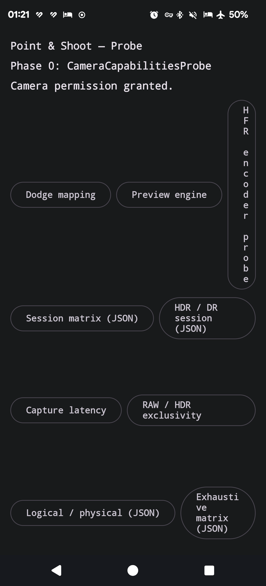 | 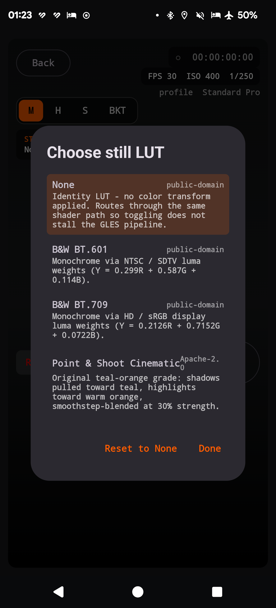 | 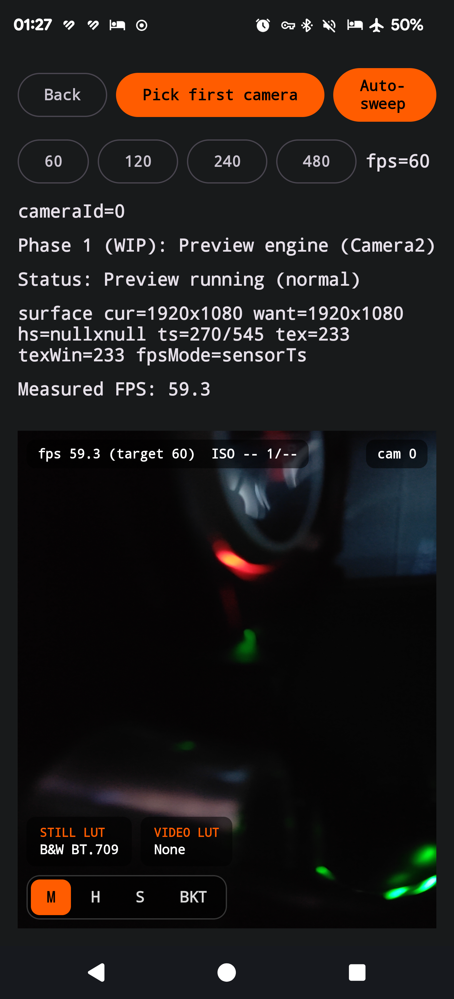 |

| Calibrate (chart-photo flavor) | Import LUT (SAF picker) | About (live `EncoderSummary` hydration) |
|---|---|---|
| 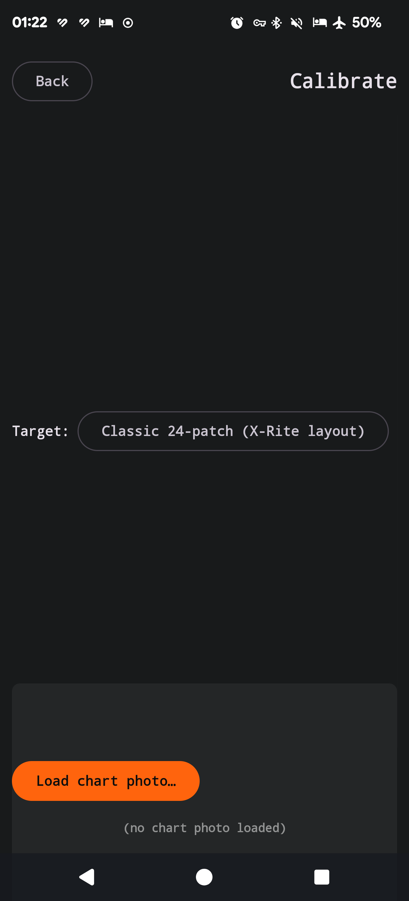 | 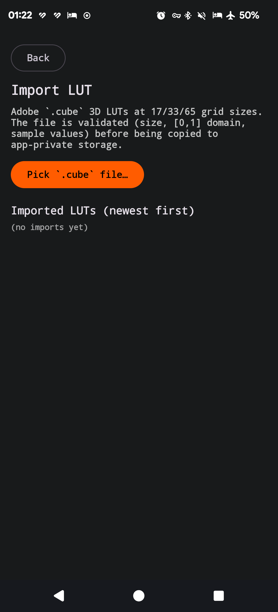 | 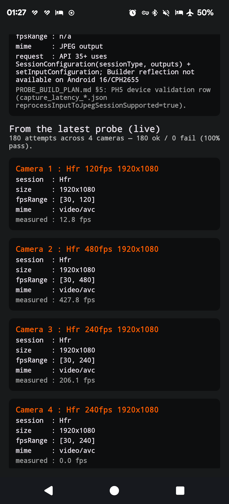 |

| GLES preview · None (identity) | GLES preview · B&W BT.709 | GLES preview · PnS Cinematic |
|---|---|---|
| 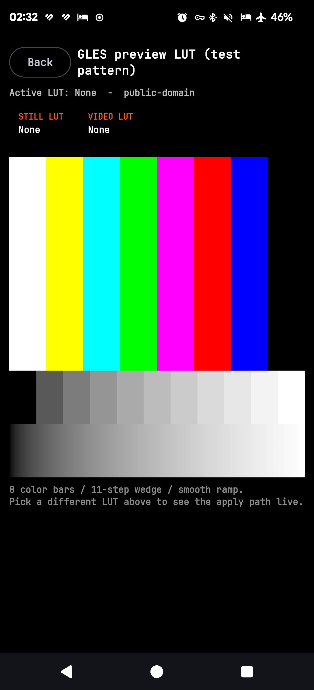 | 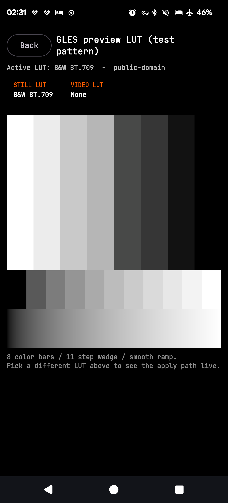 | 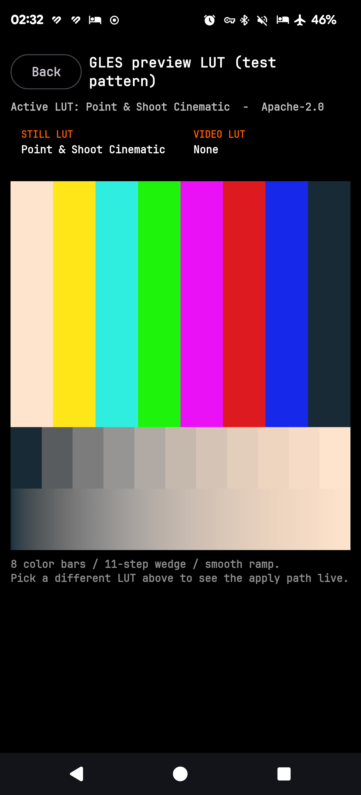 |

| Native diagnostics (Phase 0 fallback) | Lens info probe (deep caps with lensInfo) | |
|---|---|---|
| 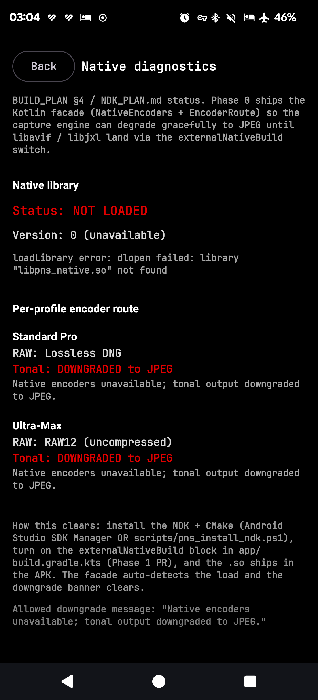 | 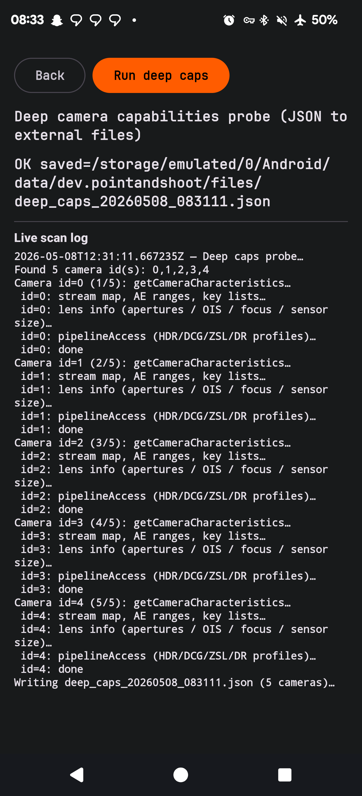 | |

The third row exercises the `LutShaderProgram` end-to-end on a synthetic `TestPattern` source: identity bypass passes the source through verbatim; B&W BT.709 collapses the bars with the documented luma weights (`Y = 0.2126R + 0.7152G + 0.0722B`); PnS Cinematic pulls shadows toward teal and highlights toward orange (visible on the wedge and the smooth ramp). The fourth row exercises the Phase 0 NDK scaffolding: `NativeEncoders.isAvailable` is `false` because `libpns_native.so` doesn't ship in the debug APK yet, and `EncoderRoute.decide(...)` correctly downgrades both Standard Pro (AVIF) and Ultra-Max (JXL) to the JPEG fallback per `FAILURE_MATRIX.md`.

See `PROBE_BUILD_PLAN.md` §5 for the full device-validation log including the underlying logcat and `uidump` artifacts.

## Quickstart

> Prereqs: Android SDK + ADB on PATH, JDK 17 (Android Studio's `jbr` works), and a connected OnePlus 13 with camera permission grantable. **Android Studio is not required.**

End-to-end build + sideload (PowerShell):

```powershell
$env:JAVA_HOME = "C:\Program Files\Android\Android Studio\jbr"
.\gradlew.bat :app:assembleDebug
adb install -r app\build\outputs\apk\debug\app-debug.apk
adb shell am start -n dev.pointandshoot/.MainActivity
```

Detailed CLI flow (no Android Studio): see [`CLI_BUILD_AND_SIDELOAD.md`](CLI_BUILD_AND_SIDELOAD.md).

Probe automation (Windows, ADB-attached device):

```powershell
.\scripts\pns_hfr_autorun.ps1 -OutDir .\hfr-runs -RunProbeSmoke -Sideload
.\scripts\pns_hfr_autorun.ps1 -OutDir .\hfr-runs -RunCoreProbePlan -ExhaustiveHfrOnly -MaxRuns 1
.\scripts\pns_hfr_autorun.ps1 -OutDir .\hfr-runs -RunFullSuite -ExhaustiveHfrOnly -MaxRuns 1
```

Toolchain gate (run after Kotlin / PowerShell changes):

```powershell
.\scripts\pns_verify_toolchain.ps1                # full
.\scripts\pns_verify_toolchain.ps1 -SkipGradle    # docs-only
.\scripts\pns_verify_toolchain.ps1 -RunTests      # full + JVM unit tests
```

## Documentation

### Product
- **Product roadmap & V&V gates** — [`BUILD_PLAN.md`](BUILD_PLAN.md)
- **Probe automation plan** — [`PROBE_BUILD_PLAN.md`](PROBE_BUILD_PLAN.md)
- **OnePlus 13 hardware-to-software mapping** — [`DODGE_PROFILE.md`](DODGE_PROFILE.md)
- **Latest probe export** — [`PROBE_RESULTS.md`](PROBE_RESULTS.md)

### Engineering
- **Capture engine architecture** (threading, backpressure, cancellation) — [`CAPTURE_ARCHITECTURE.md`](CAPTURE_ARCHITECTURE.md)
- **Performance budgets** (per mode FPS / latency / cold start) — [`PERFORMANCE_BUDGETS.md`](PERFORMANCE_BUDGETS.md)
- **Storage strategy** (MediaStore vs SAF vs app-private; per-profile destinations) — [`STORAGE_STRATEGY.md`](STORAGE_STRATEGY.md)
- **NDK pipeline plan** (libavif + libjxl + JNI surface + fallback) — [`NDK_PLAN.md`](NDK_PLAN.md)
- **Color pipeline & LUTs** (sensor → demosaic → WB → CCM → tone → LUT → encode; calibration mode flow; pinned numbers) — [`COLOR_PIPELINE.md`](COLOR_PIPELINE.md)
- **Failure matrix** (graceful-degradation policy, severity-tagged) — [`FAILURE_MATRIX.md`](FAILURE_MATRIX.md)
- **Third-party license inventory** (FOSS hygiene) — [`LICENSES.md`](LICENSES.md)
- **CLI build / sideload** — [`CLI_BUILD_AND_SIDELOAD.md`](CLI_BUILD_AND_SIDELOAD.md)

### Releases
- **Changelog** — [`CHANGELOG.md`](CHANGELOG.md)
- **Release-notes template** — [`RELEASE_NOTES_TEMPLATE.md`](RELEASE_NOTES_TEMPLATE.md)
- **Local release-signing config** — [`keystore.properties.example`](keystore.properties.example)

## Repo layout

- `app/` — Android app (Compose + Camera2 probe + Pro HUD scaffolds + capture-engine helpers)
  - `app/src/main/java/dev/pointandshoot/` — production Kotlin (`PnsTheme`, `CommandDial`, `ProHudScreen`, `LutChipRow`, `LutImporterScreen`, `ImportedLutStore`, `CalibrateScreen`, `BitmapRgbPlane`, `GLPreviewScreen`, `LutPreviewRenderer`, `TestPattern`, `NativeEncoders`, `EncoderRoute`, `NativeDiagnosticsScreen`, `RootCapability`, `RootCapabilityProbe`, `RootSettingsScreen`, `HdrCurves`, `ColorSpaceMatrix`, `WorkingSpace`, `AvifColrPayload`, `HdrStaticMetadata`, `IsobmffSampleAspect`, `AvifAuxiliaryBoxes`, `IsobmffBox`, `ItemPropertyAssociation`, `IsobmffItemProperties`, `PrimaryItemBox`, `LensInfoSummary`, `LensInfoExtractor`, `PreviewLumaHistogram`, `DngLutMetadata`, `Dng12Saver`, `DngColorTags`, `CaptureStorage`, `CaptureHaptics`, `BracketPlan`, `BracketScheduler`, `HighlightMeter`, `EyeAfOverlay`, `FaceDetectAdapter`, `TrackerState`, `CropPlan`, `CapabilityGate`, `EncoderResultAggregator`, `EncoderAttemptJsonAdapter`, `EncoderRecipeBuilder`, `PerfBudget`, `PnsLog`, `VendorKeyGuard`, `DiagnosticsMode`, `AboutScreen`, `HudSettings`, `Lut3D`, `LutPipeline`, `LutShaderProgram`, `LutImportValidator`, `BuiltInLuts`, `LutCatalog`, `LutSidecar`, `LutSidecarWriter`, `CalibrationProfile`, `CalibrationProfileJsonAdapter`, `CalibrationProfileStorage`, `CalibrationMath`, `CalibrationToLut`, `ReferenceTarget`, `BundledReferenceTargets`, `CalibrationSampler`, `SlantedEdgeMtf`, `ColorMath`, `LutCreditsBuilder`, `LutDiagnosticsBuilder`, ...)
  - `app/src/main/assets/shaders/` — GLES 3.0 shader assets (`lut_apply.vert.glsl` + `lut_apply.frag.glsl` for the live-preview / video LUT apply path).
  - `app/src/main/assets/fonts/jetbrainsmono/` — vendored JetBrains Mono Regular `v2.304` (SIL OFL 1.1) license + provenance metadata (`LICENSE.txt`, `SOURCE.txt`, `SHA256.txt`); the matching `.ttf` lives at `app/src/main/res/font/jetbrainsmono_regular.ttf`.
  - `app/src/test/java/dev/pointandshoot/` — pure-JVM unit tests (`BracketPlanTest`, `BracketSchedulerTest`, `HighlightMeterTest`, `TimecodeFormatTest`, `CaptureStorageFilenameTest`, `CropPlanTest`, `FaceDetectAdapterTest`, `TrackerStateTest`, `CapabilityGateTest`, `EncoderResultAggregatorTest`, `EncoderAttemptJsonAdapterTest`, `EncoderRecipeBuilderTest`, `PerfBudgetTest`, `PnsLogTest`, `Lut3DTest`, `LutPipelineTest`, `LutShaderProgramSourceTest`, `LutPreviewRendererQuadTest`, `TestPatternTest`, `NativeEncodersFallbackTest`, `EncoderRouteTest`, `LensInfoSummaryTest`, `PreviewLumaHistogramTest`, `Dl3ParserTest`, `Spi3dParserTest`, `DngLutMetadataTest`, `RootCapabilityTest`, `RootCapabilityProbeTest`, `HdrCurvesTest`, `ColorSpaceMatrixTest`, `WorkingSpaceTest`, `AvifColrPayloadTest`, `HdrStaticMetadataTest`, `IsobmffSampleAspectTest`, `AvifAuxiliaryBoxesTest`, `IsobmffBoxTest`, `ItemPropertyAssociationTest`, `IsobmffItemPropertiesTest`, `PrimaryItemBoxTest`, `LutImportValidatorTest`, `BuiltInLutsTest`, `LutCatalogTest`, `LutSidecarTest`, `LutSidecarWriterTest`, `HudSettingsLutResolutionTest`, `ImportedLutStoreTest`, `BitmapRgbPlaneTest`, `CalibrationMathTest`, `CalibrationToLutTest`, `CalibrationProfileJsonAdapterTest`, `CalibrationProfileStorageTest`, `CalibrationCcmAccuracyTest`, `DngColorTagsTest`, `ReferenceTargetTest`, `CalibrationSamplerTest`, `SlantedEdgeMtfTest`, `ColorMathTest`, `LutCreditsBuilderTest`, `LutDiagnosticsBuilderTest`, `MetadataSerializationGoldenTest`)
- `native/` — NDK / JNI stubs + CMake skeleton + license matrix for the planned libavif / libjxl pipeline (`pns_native.cpp` JNI stubs matching `NativeEncoders`; `CMakeLists.txt` with commented `FetchContent_Declare` blocks; `THIRD_PARTY.md` license matrix; `README.md` Phase-0 layout)
- `metadata/` — F-Droid compliance placeholders
- `scripts/` — PowerShell automation (`pns_hfr_autorun.ps1`, `pns_verify_toolchain.ps1`, `pns_probe_watch.ps1`, `pns_license_inventory.ps1`, `pns_sbom.ps1`, `pns_install_ndk.ps1`)
- `hfr-runs/` — pulled probe artifacts (gitignored)
- `.github/workflows/` — CI: toolchain verify + unit tests + debug-APK artifact (Ubuntu), plan-doc verify, signed-build (manual / `v*` tag)

## Contributing

- File issues / PRs against `main`.
- Code style: Kotlin idiomatic, UTF-8 source files (Windows users: do not save as UTF-16 LE — the toolchain gate rejects it).
- Before pushing:
  - Code changes (Kotlin / PowerShell): `.\scripts\pns_verify_toolchain.ps1 -RunTests`
  - Docs-only changes: `.\scripts\pns_verify_toolchain.ps1 -SkipGradle`
- New scripts and Kotlin sources must pass the same gate. New pure-JVM logic should ship with a JUnit test under `app/src/test/java/dev/pointandshoot/`.

## License

Apache-2.0. See [`LICENSE`](LICENSE).
