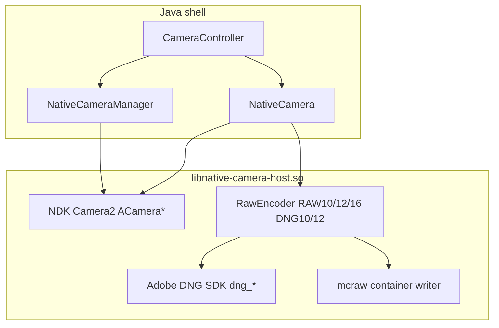

# AltReferenceApp APK analysis — native RAW video + still pipeline

**Package:** `com.altreferenceapp.pro`  
**APK on disk:** `hfr-runs/altreferenceapp_apk_decompile/altreferenceapp_pro_base.apk` (+ `split_arm64.apk` for `libnative-camera-host.so`)  
**Decompile:** `hfr-runs/altreferenceapp_apk_decompile/jadx_sources/` (jadx 1.5.1)  
**Refresh:** `.\scripts\pns_altreferenceapp_apk_decompile.ps1`  
**Needle scan:** `hfr-runs/altreferenceapp_apk_decompile/scan.json` via `scripts/referenceapp_decompile_scan.py --profile altreferenceapp`

AltReferenceApp is **not** a thin Java Camera2 wrapper like ReferenceCam. Almost all capture, RAW encode, and DNG work lives in **`libnative-camera-host.so`** using the **NDK Camera2 API** (`ACamera*`, `libcamera2ndk.so`) and an embedded **Adobe DNG SDK** (`dng_*` symbols). Java/Kotlin is a thin JNI façade.

---

## Executive summary (for Point & Shoot Milestone 13)

| Area | AltReferenceApp pattern | P&S today | Fleet takeaway |
|------|-------------------|-----------|----------------|
| **Camera API** | NDK `ACameraManager` / `ACameraDevice` / `AImageReader` in native | Java `CameraDevice` + `ImageReader` | Different stack; compare **behavior** (outputs, formats), not copy JNI |
| **Still DNG** | Native `RawEncoder::encode_DNG10/12` + DNG SDK (`dng_negative`, …) | Framework `DngCreator` + `Dng12Saver` | AltReferenceApp owns full DNG encode; P&S should fix **HAL pairing + still IQ**, not mimic DNG SDK |
| **RAW video** | `RecordToVideo` → native `RawEncoder` (RAW10/12/16) → **`.mcraw`** container | `MediaRecorder` / `MediaCodec` only (M12) | Sprint **13.6**: dedicated RAW lane + writer; **not** MediaRecorder |
| **Preview + RAW sizes** | `GetPreviewOutputConfigurations` / `GetRawOutputConfigurations` per `cameraId` | `StreamConfigurationMap` in Kotlin | Mirror as **`FleetCameraProfile`** raw/preview size tables |
| **Device policy** | `NativeDeviceSpecificProfile` JSON per `Build.MODEL` + `cameraId` | `DODGE_PROFILE` + `BackCameraRoleResolver` | **`LegacyDeviceFleetPolicy`** + JSON cache (Sprint 13.2) |
| **Logical / physical** | `NativeCameraInfo`: `cameraId`, `physicalCameraId`, `isLogicalCamera` | Leaf open for focal slots (M11.2) | Catalog should store both ids like AltReferenceApp |
| **Vignette / shading** | `NativeCameraStartupSettings.viewfinderVignetteCorrection`, `disableVignetteCorrection` | No still lens-shading map (grep) | Align with ReferenceCam: still **`STATISTICS_LENS_SHADING_MAP_MODE`** when profile allows |
| **DCG / EnableHDRDCGMode** | **Not present** in this APK (no `codeaurora` / `EnableHDR` strings in dex or `.so`) | **`DcgSessionParameters`** on REGULAR session when HUD research DCG or **`pns_preview_video_dcg`** (Sprint **13.4** host wire; USB gate pending) | Do **not** wait on AltReferenceApp for DCG; Qualcomm key from P&S probe |
| **Encoded HDR video** | `RecordToScreen` + `NativeExportOptions` / HEVC paths in Java (`I2/a.java`) | DCG + HDR10 MediaCodec path (shipped M12) | P&S encoded path is already closer to “phone HDR video” than AltReferenceApp RAW lane |

---

## Architecture map



---

## 1. Fleet camera catalog

### `NativeCameraManager`

- `GetSupportedCameras()` → `NativeCameraInfo[]`
- `GetMetadata(cameraId)` → `NativeCameraMetadata`
- `GetPreviewOutputConfigurations(cameraId)` → `NativeCameraRawOutput[]` (preview stream sizes; `bits=8` for YUV-style preview)
- `GetRawOutputConfigurations(cameraId)` → `NativeCameraRawOutput[]` (RAW; `bits=16` labeled **`RAW_SENSOR`** in `toString()`)

### `NativeCameraInfo`

| Field | Role |
|-------|------|
| `cameraId` | Id passed to `StartCapture` |
| `physicalCameraId` | Associated physical id when logical |
| `isLogicalCamera` | Logical multi-cam flag |
| `isFrontFacing` | Lens facing |
| `fpsRange` | Supported FPS list for video |

**P&S direction (Sprint 13.5):** `FleetCameraCatalog` + `FleetCameraProfile` should expose the same logical/physical pairing and RAW/preview configuration lists, seeded from probe hub + `DODGE_PROFILE` on legacy SKU.

### `NativeDeviceSpecificProfile`

Built per session: `deviceModel` = `Build.MODEL`, `cameraId`, `disableShadingMap` from user “vignette correction” pref. Passed as JSON into `NativeCamera.Create(...)`.

---

## 2. Session / capture (preview + still)

### `NativeCamera.startCapture`

```text
StartCapture(cameraId, previewSurface,
  previewW, previewH,
  rawW, rawH, rawBits,
  NativeCameraStartupSettings JSON,
  sessionListener)
```

- **Two** `NativeCameraRawOutput` selections: preview dimensions + RAW dimensions/format (`bits` 8 / 10 / 12 / 16).
- Startup settings include **viewfinder** NR/sharpness/tonemap/vignette and manual exposure/focus/WB — separate from still post-process.

### Still capture (native)

| JNI | Purpose |
|-----|---------|
| `CaptureZslImage` | ZSL still |
| `CaptureBurstImage` | Burst still |
| `CaptureHdrImage` | HDR still bracket |

Post-process via `NativePostProcessSettings` JSON (not analyzed here).

**No Java `DngCreator`** — DNG bytes come from native `RawEncoder::encode_DNG10/12` and DNG SDK classes (`dng_negative`, `dng_metadata`, …) visible in `libnative-camera-host.so`.

---

## 3. RAW video (MCRAW)

### Java entry

```java
// NativeCamera.java
public boolean recordVideo(..., NativeRecordingListener listener) {
    return RecordToVideo(iArr, f, i4, postProcessJson, ...);
}
```

### Container

- Extension **`.mcraw`**, MIME `application/octet-stream` (`CameraController.MCRAW_MIME_TYPE`).
- Document provider filters: `h0.a(".mcraw", List.of("IMAGE"))` and gallery management in `ManageVideosFragment` / `VideoProcessWorker` (transcode/export replaces extension in some paths).

### Native encode (from `.so` symbol names)

| Symbol | Meaning |
|--------|---------|
| `altreferenceapp::encoder::RawEncoder::encode_RAW10` | Pack RAW10 frames |
| `altreferenceapp::encoder::RawEncoder::encode_RAW12` | Pack RAW12 frames |
| `altreferenceapp::encoder::RawEncoder::encode_RAW16` | Pack RAW16 / sensor-depth path |
| `encodeAndBin_*` | Optional temporal binning for video |
| `RawEncoder_Legacy::*` | Older encode path still linked |

**P&S Sprint 13.6:** Implement `RawVideoRecordingController` + `RawVideoWriter` with a **documented** container layout (AltReferenceApp `.mcraw` is proprietary — treat as **inspiration**, reverse only what 13.1/13.6 USB tests require). Use dedicated REGULAR session with RAW `ImageReader`; do not attach RAW surfaces to `MediaRecorder`.

### Encoded video (separate lane)

- `RecordToScreen` — display/recorder path with LUT `ByteBuffer` (preview burn-in / screen record class).
- Java references **HEVC** in `I2/a.java` — encoded export, not the RAW lane.

---

## 4. DCG / HDR session parameters

**Finding (this APK build, May 2026):** Neither `base.apk` nor `libnative-camera-host.so` contains strings `EnableHDR`, `HDRDCG`, `codeaurora`, or `qcamera3`.

The BUILD_PLAN M12 note (“AltReferenceApp research: DCG is session parameter”) is **not evidenced** in the decompiled AltReferenceApp build on device. AltReferenceApp may use vendor APIs only inside native code without those literal strings, or a different product build.

**P&S Sprint 13.4** remains: wire **`org.codeaurora.qcamera3.sessionParameters.EnableHDRDCGMode`** (and fallbacks) on **`SessionConfiguration.setSessionParameters`** when `VideoCodec.DCG` / research toggle — same as already probed on legacy SKU for encoded HDR10, independent of AltReferenceApp.

---

## 5. Comparison to ReferenceCam (still DNG)

| | ReferenceCam | AltReferenceApp |
|---|---------|---------------|
| API | Java Camera2 | NDK Camera2 |
| DNG | `DngCreator(chars, result)` | Native DNG SDK + `RawEncoder` |
| Lens shading on still | `STATISTICS_LENS_SHADING_MAP_MODE` | Pref-driven vignette / `disableShadingMap` in device profile |
| Fleet enum | Java `m0.T.X` hidden-id probe | `NativeCameraManager.GetSupportedCameras` |

For **aux DNG color** on legacy device, ReferenceCam is the closer reference for **metadata pairing**; AltReferenceApp is the reference for **RAW video packaging** and **native RAW format encode**.

---

## 6. Recommended P&S actions (by sprint)

| Sprint | Action |
|--------|--------|
| **13.2** | `FleetCameraProfile` with preview + RAW output lists, `physicalCameraId`, device JSON like `NativeDeviceSpecificProfile` |
| **13.3** | ReferenceCam-aligned still path (`DngCreator` + lens shading); do not port DNG SDK |
| **13.4** | Qualcomm DCG session template (not from AltReferenceApp strings) |
| **13.6** | `RecordToVideo`-class behavior: RAW `ImageReader` loop → `.mcraw`-style or documented open container; `pns_raw_video_verify.ps1` |

---

## 7. Key source anchors

| Topic | Location |
|-------|----------|
| JNI camera | `com/altreferenceapp/pro/camera/NativeCamera.java` |
| Camera list / RAW sizes | `com/altreferenceapp/pro/camera/NativeCameraManager.java` |
| RAW size descriptor | `com/altreferenceapp/pro/camera/cpp/NativeCameraRawOutput.java` |
| Device JSON | `com/altreferenceapp/pro/camera/cpp/NativeDeviceSpecificProfile.java` |
| Startup IQ | `com/altreferenceapp/pro/camera/cpp/NativeCameraStartupSettings.java` |
| MCRAW UX | `com/altreferenceapp/pro/CameraController.java` |
| Native library | `lib/arm64-v8a/libnative-camera-host.so` (pull via script split or device) |

---

## 8. Related repo docs

- [`REFERENCEAPP_APK_FLEET_ANALYSIS.md`](REFERENCEAPP_APK_FLEET_ANALYSIS.md) — still DNG + Java Camera2 reference  
- [`RAW_REFERENCE_APP_MATRIX.md`](RAW_REFERENCE_APP_MATRIX.md) — triangulation table  
- [`DNG_PS_ALIGNMENT_SPIKE.md`](DNG_PS_ALIGNMENT_SPIKE.md) — P&S still IQ spikes  
- [`BUILD_PLAN.md`](../BUILD_PLAN.md) — Milestone 13 (Fleet RAW parity)

---

*Generated from decompile of AltReferenceApp on device `legacy serial` (OnePlus legacy SKU class), May 2026. Re-run decompile after app update.*
