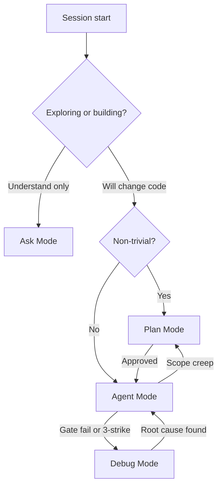

# Cursor Modes

> Router for Cursor **Ask**, **Plan**, **Agent**, and **Debug** modes. Distinct from Bootstrap/Reference **repo mode** in [`START_HERE.md`](START_HERE.md).

## Mode table

| Mode | When | Artifact | Do not use for |
|------|------|----------|----------------|
| **Ask** | Read-only exploration, architecture questions, index lookup | [`TEMPLATE_INDEX.json`](../TEMPLATE_INDEX.json), [`KNOWLEDGE_BASE.md`](../KNOWLEDGE_BASE.md) | Editing files |
| **Plan** | Non-trivial work: features, ADRs, parallel scope, schema/session changes | BUILD_PLAN row + `### Critique` + parallel scopes | Mechanical lint fixes |
| **Agent** | Approved plan execution, `[AGENT]` BUILD_PLAN rows, gate autofix | [`pns_watch_agent_gates.ps1`](../scripts/pns_watch_agent_gates.ps1) | Unapproved architecture / CRITICAL lock flips |
| **Debug** | Unknown root cause: CI red, USB gate fail, 3-strike failures | Runtime logs + [`AGENT_REGRESSION_MEMORY.md`](AGENT_REGRESSION_MEMORY.md) + [`FOR_AGENTS.md`](FOR_AGENTS.md) Failure Playbook | Pre-release checklists (`/audit`) |

Full BUILD_PLAN owner labels (`AGENT`/`HUMAN`/`ADB`/`AUTO`) are orthogonal — see [`BUILD_PLAN.md`](../BUILD_PLAN.md).

## Trivial vs non-trivial

| Signal | Mode | Example in this repo |
|--------|------|----------------------|
| Read-only question | **Ask** | "How does `pns_validate_bootstrap.ps1` work?" |
| ≤3 files, no session/DNG/schema change, gate autofix | **Agent** | Doc typo; Tier 0 script path fix |
| New feature, ADR, capture/session change, parallel scope | **Plan** | RAW stream preference; fleet matrix schema |
| Same fix failed 3× or CI/USB red, unknown cause | **Debug** | `ERROR_CAMERA_DEVICE` after capture; CodeQL fail |
| Mid-task architecture pivot | **Plan** | Shared type / matrix contract change |

If uncertain, default to **Plan**.

## When to switch

| From | To | Trigger |
|------|-----|---------|
| Ask | Plan | User says "implement" or "build" |
| Ask | Agent | Trivial fix confirmed by rubric |
| Plan | Agent | Plan approved ("execute the plan") |
| Agent | Debug | Gate exit 1 after autofix; CI red; flaky USB |
| Agent | Plan | Schema/session lock change; scope expanded |
| Debug | Agent | Root cause confirmed; fix approach agreed |
| Debug | Plan | Fix requires architectural change |
| Any | Ask | Exploratory question mid-session |

Do not debug in Plan Mode. Do not edit in Ask Mode.

## Batch commands

Slash commands in `.cursor/commands/` — **`/audit` ≠ Debug Mode**. Use `/debug` or Debug Mode for defect investigation.

| Audience | Doc |
|----------|-----|
| Humans | [`docs/help/BATCH_COMMANDS.md`](help/BATCH_COMMANDS.md) |
| Agents | [`docs/BATCH_COMMANDS.md`](BATCH_COMMANDS.md) |

## Naming disambiguation

| Term | Means | Not the same as |
|------|--------|-----------------|
| **Cloud Agents** | Paid remote VMs | Local Agent Mode |
| Built-in **`/plan`** | Product Plan Mode toggle | Batch [`.cursor/commands/plan.md`](../.cursor/commands/plan.md) |
| **Reference repo mode** | Existing product using bootstrap process | Cursor Ask/Plan/Agent/Debug |

## Local compute first

On **This Computer**, prefer machine parallelism over Cloud Agents:

| Lever | Use |
|-------|-----|
| Parallel `/scope` Task subagents | After Sequential lock; asymmetric file scopes |
| `pns_agent_worktree_bootstrap.ps1` | Isolated `feature/agent-*` worktrees |
| Local gates | `pns_local_dev_parallel.ps1` (Tier 0) |
| USB | One serial; never capture ∥ chrome |

Rule: [`.cursor/rules/local-compute.mdc`](../.cursor/rules/local-compute.mdc). Details: [`MULTI_AGENT_PARALLEL_ORCHESTRATION.md`](MULTI_AGENT_PARALLEL_ORCHESTRATION.md).
