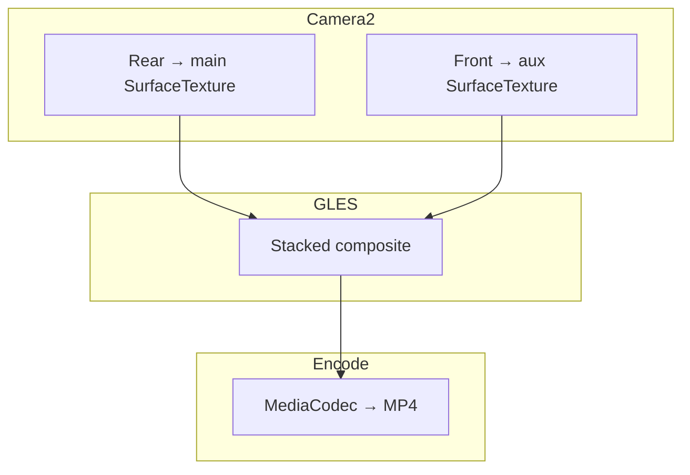

# Milestone 14.12 — Dual video (stacked, single MP4)

**Status:** Shipped — rear + front **stacked** GLES preview (front top, rear bottom), front `CameraDevice`, GL composite to **MediaCodec** encoder at **1920×1080** @ **30 fps**. [`PreviewSelfieRingIndicator`] in the **top inset** (punch-hole) rotates while Dual mode is active.

## LG heritage (reference)

LG **Dual recording** ([VS980 guide](https://www.lg.com/us/mobile-phones/VS980/Userguide/258.html), [VS986 Dual Feature](https://www.lg.com/us/mobile-phones/VS986/Userguide/232.html)) records **both cameras into one file** with a **main viewfinder** and a **smaller draggable overlay** (picture-in-picture). Some models also offered two separate files.

**Point & Shoot v1** uses a **vertical stack** (front top, rear bottom) in preview and in the encoded MP4 — simpler than LG PiP but same idea: one moment, two angles, one clip. PiP overlay may follow in a later sprint.

## Goal

Record **rear + front** simultaneously into **one** H.264/HEVC MP4. Video-only: **`CommandDialMode.Dual`** when the tray is in **Video**.

## v1 constraints

| Item | Choice |
|------|--------|
| Output | Single MP4 via **MediaCodec** Surface + [DualVideoGlEncoderSink] (GL composite) |
| Layout | **Stacked:** front top ~50%, rear bottom ~50% (full width each); center-contain per half; orange ring in status inset |
| Resolution | **1080×1920** portrait composite (stacked top/bottom; muxer rotation **0**) |
| Frame rate | **30 fps** (HFR dual out of scope) |
| Audio | Rear / camcorder mic (same as single in-app video) |
| Front preview | No LUT / no readout WB tint (avoids green cast from rear LUT) |
| Photo tray | **Dual** hidden when `CaptureMediaFamily.Photo` |

## Session graph

1. Rear: existing preview session (no encoder surface attached in Dual mode).
2. Front: [DualVideoFrontCameraController] → aux OES texture.
3. [LutCameraPreviewRenderer] draws stacked layout to display + recordable EGL window surface.
4. Stop → muxer finalizes under `Movies/PointAndShoot/`.

## HAL / fleet risks

- **Concurrent cameras:** `CameraManager.getConcurrentCameraIds()` when API 30+; still attempt open if unlisted (CPH2655).
- **Thermal:** 1080p30 dual cap.
- **Chrome lock:** **Dual** only in Video programs dropdown.

## Code pointers

| File | Role |
|------|------|
| `DualVideoRecordingController.kt` | Sizes, logging, concurrent probe |
| `DualVideoFrontCameraController.kt` | Front session |
| `DualVideoGlEncoderSink.kt` | EGL recordable composite |
| `LutCameraPreviewRenderer.kt` | Stacked draw + encoder feed |
| `pns_dual_video_verify.ps1` | USB gate (preview + optional record) |

## Verification

- **Host:** `.\scripts\pns_dual_video_verify.ps1 -HostOnly`
- **USB:** `.\scripts\pns_dual_video_verify.ps1` — `dualFront session ready`, `dualGlRecordArmed`; with **`-RecordSec 5`**: `inAppVideoSaved ok=true` + minimum bytes.
