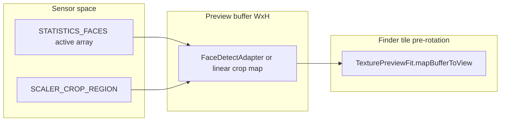

# Preview face / eye HUD — coordinate pipeline (incl. HFR)

This note backs **BUILD_PLAN** Sprint **10.7** (*Face / eye HUD under HFR*): how statistics and ML paths land on the same pixels as the live finder, and how tap-to-focus shares buffer space.

## Pipeline (Camera2 statistics path)

1. **`CaptureResult.STATISTICS_FACES`** — bounds and eye points are in **`SENSOR_INFO_ACTIVE_ARRAY_SIZE`** space (sensor-fixed axes).
2. **Scaler crop** — when `SCALER_CROP_REGION` is meaningfully tighter than the active array, landmarks are mapped with **`mapActivePointToBufferWithScalerCrop`** (linear normalize within the crop, then multiply by negotiated preview `W×H`). This matches the inverse of tap-to-focus normalization (see `PreviewController.applyTapFocusFromView`).
3. **Full-active path** — when the crop matches the full active array (typical **HFR** 16:9 preview on a 4:3-class sensor), **`FaceDetectAdapter`** rotates by **`SENSOR_ORIENTATION`**, then maps into the preview buffer:
   - **Below 120 fps target:** legacy **independent** X/Y scale (stretch) onto `W×H` (legacy behavior for non-HFR previews that already matched aspect).
   - **`desiredFps >= 120`:** **uniform center-crop** scale `max(W/frameW, H/frameH)` plus centered offsets — same policy as **`TexturePreviewFit.mapBufferToView`** with **`coverCrop = true`** so boxes line up with the GL finder.
4. **Compose overlay** — buffer-space **`EyeMark`** / **`FaceTrackBoxBuffer`** are converted to tile pixels with **`TexturePreviewFit.mapBufferToView`** (and the preview tile size from `PreviewMainViewport`), inside the same rotated content box as **`LutCameraPreviewRenderer`**.

## Tap-to-focus

**`applyTapFocusFromView`** maps view → buffer with **`TexturePreviewFit.mapViewToBuffer`**, using **`desiredSurfaceSize ?: currentSurfaceSize`** so buffer size matches the face/eye path during startup races. Normalized buffer coordinates are applied to the same scaler crop rectangle used for metering.

## Diagram (buffer vs view)

## ML fallback

When the YUV analysis stream is present, **`MlKitFaceTrackSupport`** maps detections through **`TexturePreviewFit.mapYuvRectToFaceTrackBoxBuffer`** into buffer space, then the same **`mapBufferToView`** step as above. HFR sessions often omit YUV; the statistics path above is the one that must stay self-consistent at **≥120 fps**.
