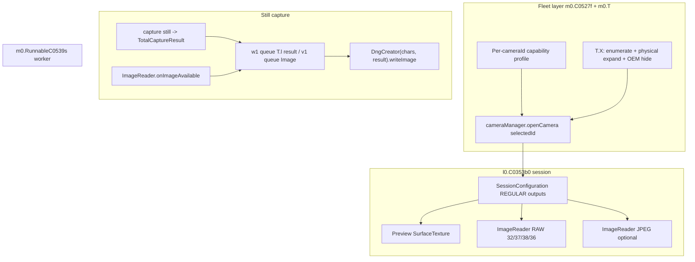

# ProShot APK analysis — RAW pipeline and fleet camera handling

**Package:** `com.riseupgames.proshot2`  
**APK on disk:** `hfr-runs/proshot_apk_decompile/proshot2_base.apk` (pulled from device May 2026)  
**Decompile:** `hfr-runs/proshot_apk_decompile/jadx_sources/` (jadx 1.5.1)  
**Refresh:** `.\scripts\pns_proshot_apk_decompile.ps1`  
**Needle scan:** `hfr-runs/proshot_apk_decompile/scan.json` via `scripts/proshot_decompile_scan.py`

ProShot is **heavily obfuscated** (`l0.C0353b0` = main camera controller, `m0.T` = camera utilities, `m0.C0527f` = per-device capability profile, `m0.RunnableC0539s` = save runnable). Names below use decompiler symbols.

---

## Executive summary (for Point & Shoot fleet goals)

| Area | ProShot pattern | P&S today | Fleet takeaway |
|------|-----------------|-----------|----------------|
| **Camera catalog** | Enumerate API ids + **expand logical → physical** + probe hidden ids `0…99` + **OEM model → hide id** map | `BackCameraRoleResolver`, `DODGE_PROFILE`, probe hub | Add a **fleet device profile** object (like `C0527f`) + model blocklist, not only role tables |
| **Lens switch** | **`openCamera(leafId)`** — same leaf ids as our M14/M23/M73 (`dumpsys` 3/2/4) | Same leaf routing after May 2026 fix | Keep **leaf `CameraDevice`** for aux slots; avoid logical-only tele |
| **Preview pin** | Optional `OutputConfiguration.setPhysicalCameraId(C0250o.y1)` on **preview** when flag set | Preview-only pin on **logical** parent | Different: ProShot can pin preview to physical id string; P&S pins only on logical multi-cam — do not copy blindly |
| **DNG metadata** | `DngCreator(**active device** characteristics, **still** `CaptureResult`) — **no** hybrid physical/logical resolver | `DngMetadataResolver` + `allowPhysicalTotalResultPairing=false` on logical | On **leaf sessions**, pair **same** `cameraId` characteristics + result; skip resolver fork |
| **RAW format** | Try `32, 37, 38, 36` on **opened** camera’s stream map | `RawCaptureSupport` + logical aux `RAW_SENSOR` preference | Align pick order with ProShot on **leaf** `StreamConfigurationMap` |
| **Still IQ keys** | `STATISTICS_LENS_SHADING_MAP_MODE_ON` + `SHADING_MODE` / `TONEMAP` on **still** builder when prefs + caps | No lens-shading map on still (grep) | Gate still capture on caps; match ProShot still template |
| **Still pairing** | `ImageReader` queue + `TotalCaptureResult` queue → save on worker | Direct still callback | Our ADB/session gating fix is in the same spirit (don’t capture until session matches) |
| **DNG file tags** | Same `FM1[0,0]=0.4375` as P&S on CPH2655 | Same | Color gap is **not** TIFF FM rewrite — session/ISP/shading/pairing |

---

## Architecture map



---

## 1. Fleet camera catalog (`m0.T.X`, `m0.C0527f`)

### Enumeration (`T.X(CameraManager, boolean)`)

1. Start from `cameraManager.getCameraIdList()`.
2. On API 30+, for each **logical multi-camera** (`REQUEST_AVAILABLE_CAPABILITIES` contains `LOGICAL_MULTI_CAMERA`):
   - Walk `getPhysicalCameraIds()`.
   - Classify physical ids by focal length (`u0(characteristics)` ≈ mm bucket).
   - Add physical ids to the user-visible list when they don’t match the logical parent’s focal bucket.
3. **Hidden camera probe:** loop `cameraId` `"0"` … `"99"`; if `getCameraCharacteristics` succeeds but id is **not** in the public list, treat as hidden/aux (unless blocked).
4. **OEM blocklist:** `Build.MANUFACTURER + " " + Build.MODEL` matched against `C0250o.f5255K0` (map of model → camera id to **remove** from hidden list).

This is exactly what a **fleet app** needs: public HAL ids, logical children, non-listed ids, and per-model overrides.

### Per-device profile (`C0527f`)

Constructed from `CameraCharacteristics` + `StreamConfigurationMap` for each opened id. Notable probes:

| Flag / field | Source | Use |
|--------------|--------|-----|
| `f6655v` | RAW sizes for formats **32, 38, 37, 36** | Device supports DNG path |
| `f6567F` | `STATISTICS_INFO_AVAILABLE_LENS_SHADING_MAP_MODES` contains `ON` | Can request shading map on stills |
| `f6646q0` / `f6648r0` | `SHADING_AVAILABLE_MODES` FAST / HIGH_QUALITY | `CaptureRequest.SHADING_MODE` |
| `f6644p0` | `CONTROL_POST_RAW_SENSITIVITY_BOOST_RANGE` | RAW boost / ISO semantics |
| `f6642o0` | Distortion correction modes | Still pipeline |
| Video / 8K flags | `CamcorderProfile`, recorder sizes | Feature gating |

**P&S direction:** Extend `docs/RAW_CAPTURE_DEVICE_MATRIX.md` / probe export with a **structured `FleetCameraProfile`** (Kotlin data class) populated once per `cameraId`, persisted optional, fed into capture templates — mirror ProShot’s `C0527f` rather than scattering booleans in `PreviewEngineScreen`.

---

## 2. Opening cameras and switching lenses

- Selected id: `C0353b0.f5939m0` → `cameraManager.openCamera(this.f5939m0, …)`.
- Active characteristics for UI + DNG: `m0.T.f6459a.f6612b` (singleton `C0527f`’s `CameraCharacteristics` for the **currently opened** id).
- Preview optional physical pin: `C0250o.y1` non-empty → `outputConfiguration.setPhysicalCameraId(C0250o.y1)` in `l5()` when `u1 && !P1`.

**ADB-confirmed behavior (CPH2655):** ProShot **CONNECT 3 → 2 → 4** when shooting UW / wide / tele — same as P&S `focalSlotTap` after dodge routing fix.

**Preview metadata:** `R4(TotalCaptureResult)` reads `LOGICAL_MULTI_CAMERA_ACTIVE_PHYSICAL_ID` and dispatches to UI — only relevant when preview runs on a **logical** id; leaf sessions use the opened id directly.

---

## 3. Capture session construction

- **REGULAR** `SessionConfiguration` (mode `0`) with `OutputConfiguration` per surface (`createCaptureSession(sessionConfiguration)`).
- Surfaces: preview `SurfaceTexture`, optional JPEG `ImageReader`, RAW `ImageReader` (`f5906E0`), video/recorder surfaces as needed.
- **High speed:** `createConstrainedHighSpeedCaptureSession` when HFR mode.
- **Extensions:** API 31+ `createExtensionSession` when extension mode enabled (`C0250o.f5329t0`).
- Stream sizes: `T.x0(characteristics, quality tier, imageFormat)` stored on profile (`f6589Q` … `f6597U`) — per-device **tiered size tables**.

**P&S:** Already uses REGULAR + unpinned RAW on logical multi-cam (locked). Consider **tiered still size pick** similar to `T.x0` instead of a single `pickRawOutput` path per fleet device.

---

## 4. RAW still pipeline

### ImageReader listener (`C0353b0.f`)

```java
// onImageAvailable: queue image + format, then drain save pipeline
v1.add(imageReader.acquireNextImage());
x1.add(imageReader.getImageFormat());
h6();
```

Formats treated as RAW for save (`f6720j`): **32, 37, 38, 36** (`RAW_SENSOR`, `RAW12`, etc.).

### Capture callback (`CaptureCallback.onCaptureCompleted`)

```java
synchronized (w1) {
    w1.add(new T.l(totalCaptureResult));
}
h6();
```

`T.l` wraps `CaptureResult` and extracts ISO, exposure, focal length, flash, etc. for EXIF sidecar on JPEG; for DNG the **`CaptureResult` reference** is passed through.

### Save (`m0.RunnableC0539s.h`)

```java
DngCreator dngCreator = new DngCreator(this.f6722l, this.f6723m.f6519a);
dngCreator.writeImage(outputStream, this.f6711a);
```

- `f6722l` = `m0.T.f6459a.f6612b` (**characteristics for opened camera**).
- `f6723m.f6519a` = **`CaptureResult` from still** (typically `TotalCaptureResult`).

**No** `physicalCameraTotalResults` picking, **no** post-save color matrix TIFF surgery in this path.

Constructor call site (`h6`):

```java
new RunnableC0539s(..., m0.T.f6459a.f6612b, lVar);
```

So DNG color is entirely **framework `DngCreator` + HAL tags** for the **same** leaf (or logical) session that produced the buffer.

---

## 5. Still capture request IQ (why ProShot color can differ)

On the **still** `CaptureRequest.Builder` (`builder3` path ~6360–6410), when capturing still (`z2 == true`):

| Request | Condition |
|---------|-----------|
| `STATISTICS_LENS_SHADING_MAP_MODE` **ON** | User pref `LENS_SHADING_MAP` && profile `f6567F` |
| `SHADING_MODE` **HIGH_QUALITY** (2) or **FAST** (1) | User `VIGNETTE_CORRECTION` + profile shading flags |
| `TONEMAP_MODE` | Image+ / profile flags |
| `COLOR_CORRECTION_ABERRATION_MODE` | Image+ |
| `DISTORTION_CORRECTION_MODE` | If modes advertised in `f6642o0` |

Preview repeating requests use a **subset** (e.g. shading mode 0/1 without map).

**P&S alignment (from `DNG_PS_ALIGNMENT_SPIKE.md`):** Add gated `STATISTICS_LENS_SHADING_MAP_MODE_ON` (and shading mode) on **RAW still** requests when characteristics allow — USB A/B vs ProShot in normal light when UW automation is reliable.

---

## 6. What ProShot does *not* do (important for P&S)

- **No** in-app `DngForwardMatrixFix` / ASN matrix rewriting in `RunnableC0539s`.
- **No** evidence of pairing **physical** `CameraCharacteristics` with **logical** `TotalCaptureResult` in the DNG path — it uses the **opened** device’s characteristics.
- **DNG tags** on CPH2655 still show **shared wide FM** in IFD0 — same as P&S; good ProShot color is **not** explained by different ForwardMatrix bytes in file.

Do **not** reintroduce FM/ASN TIFF patches to “match” ProShot.

---

## 7. Recommended P&S fleet roadmap (priority)

1. **`FleetCameraProfile` per `cameraId`** — one-shot probe: RAW formats/sizes, shading map, logical/physical set, max still size, HFR lists (populate from existing probe hub + `C0527f`-style fields).
2. **Leaf DNG path** — if `sessionCameraId` has empty `physicalCameraIds` OR session opened as leaf: `DngCreator(cm.getCameraCharacteristics(id), stillResult)` without `DngMetadataResolver` physical pick.
3. **Still template** — `STATISTICS_LENS_SHADING_MAP_MODE` + `SHADING_MODE` from profile + user pref (default on for RAW when supported).
4. **Catalog UI / automation** — expose enumerated ids (public + hidden + roles) like ProShot’s lens picker; persist OEM blocklist entries from fleet JSON.
5. **Session readiness** — keep `sessionCommittedGeneration` + focal-slot ADB wait (shipped May 2026); extend with ProShot-style **image/result queue** depth check optional.
6. **Validation** — `pns_dng_proshot_pns_session.ps1` in **daylight** for 3/3 UW; dark room is stress-only for HAL failures.

---

## 8. Key source anchors (decompiled)

| Topic | File | Notes |
|-------|------|--------|
| DNG save | `m0/RunnableC0539s.java` | `DngCreator`, formats 32/37/38/36 |
| Still queues | `l0/C0353b0.java` | `f`, `h6`, `onCaptureCompleted` |
| Session create | `l0/C0353b0.java` | ~4396–4443 `SessionConfiguration` |
| Physical pin | `l0/C0353b0.java` | `l5()` `setPhysicalCameraId` |
| Lens shading still | `l0/C0353b0.java` | ~6405–6410 |
| Enumeration | `m0/T.java` | `X()`, `N()`, hidden ids |
| Device profile | `m0/C0527f.java` | RAW + shading capability probe |
| Result wrapper | `m0/T.java` | inner class `l` |

---

## 9. Related repo docs

- [`DNG_PS_ALIGNMENT_SPIKE.md`](DNG_PS_ALIGNMENT_SPIKE.md) — implementation spikes (shading, leaf DNG).
- [`DNG_PROSHOT_ADB_FINDINGS.md`](DNG_PROSHOT_ADB_FINDINGS.md) — dumpsys CONNECT 3/2/4.
- [`DNG_REFERENCE_APPS.md`](DNG_REFERENCE_APPS.md) — ProShot as reference app.
- [`AGENTS.md`](../AGENTS.md) — USB scripts; do not regress logical RAW / DNG locks.

---

*Generated from decompile of ProShot 2.x `base.apk` on device `8bf09993` (OnePlus CPH2655 class). Re-run decompile after app update.*
